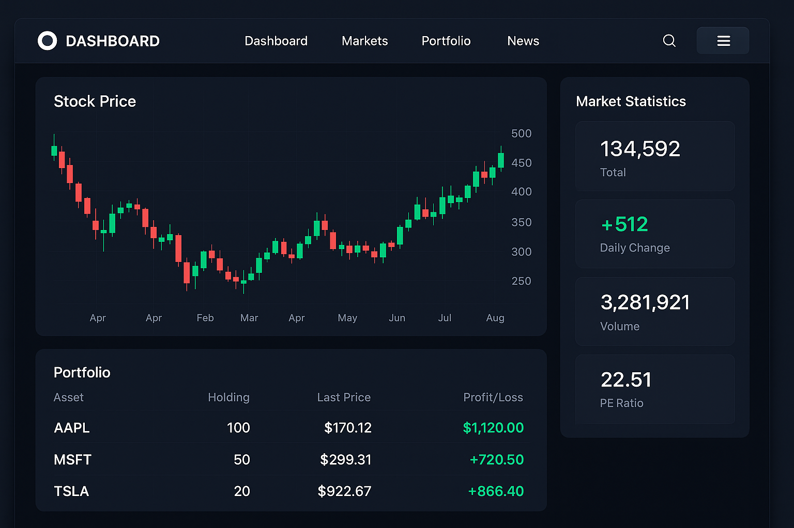
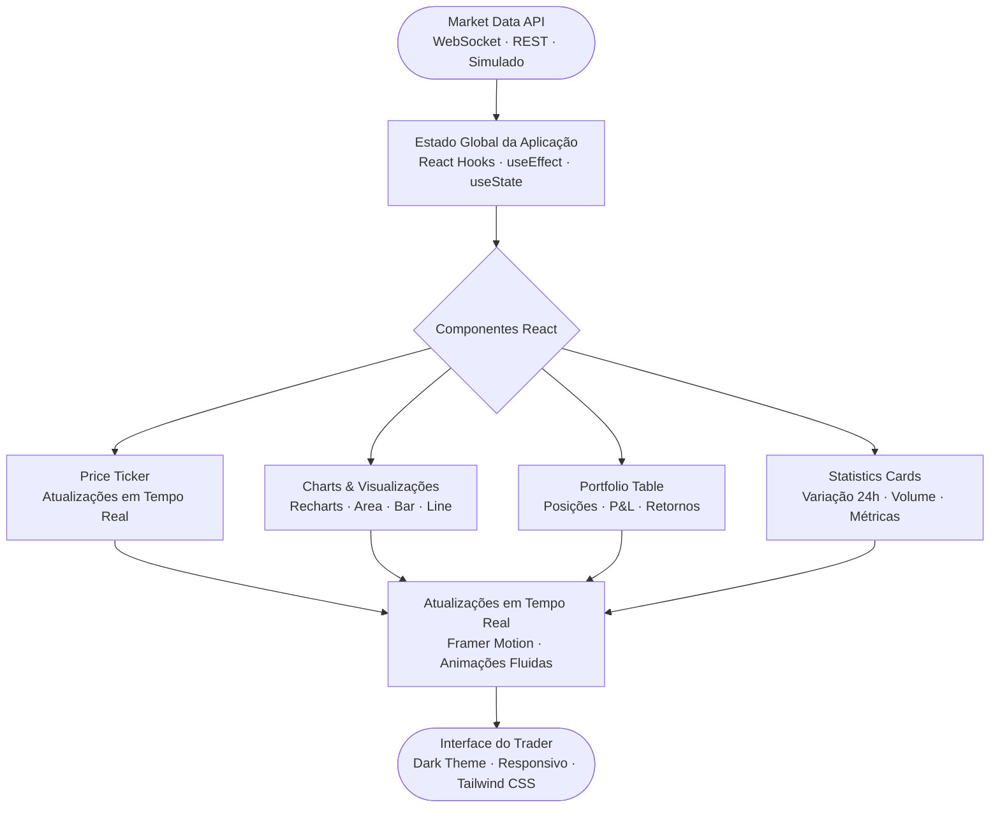

# 📊 Trading Dashboard

[](https://reactjs.org/)
[](https://vitejs.dev/)
[](https://tailwindcss.com/)
[](https://recharts.org/)
[](LICENSE)
[](Dockerfile)

[English](#english) | [Português](#português)

---

## English

### 🎯 Overview

**Trading Dashboard** is a professional, real-time trading dashboard built with React and modern web technologies. Features beautiful charts, portfolio tracking, market analytics, and a responsive design optimized for traders and financial professionals.

Perfect for quantitative traders, portfolio managers, and anyone who needs a clean, fast, and intuitive interface for monitoring financial markets.

### 📸 Screenshot



A modern, dark-themed dashboard with real-time candlestick charts, portfolio tracking, and market statistics.

### ✨ Key Features

#### 📈 Real-Time Data
- **Live Price Updates**: Simulated WebSocket-like price updates
- **Interactive Charts**: Area charts, bar charts, and line charts
- **Portfolio Tracking**: Real-time P&L calculation
- **Market Statistics**: 24h change, volume, and more

#### 🎨 Modern UI/UX
- **Responsive Design**: Works on desktop, tablet, and mobile
- **Dark Theme**: Easy on the eyes for long trading sessions
- **Smooth Animations**: Framer Motion for fluid transitions
- **Professional Layout**: Clean and intuitive interface

#### 📊 Charts & Visualization
- **Price Charts**: Area charts with gradient fills
- **Volume Charts**: Bar charts for volume analysis
- **Recharts Library**: Professional charting library
- **Customizable**: Easy to add new chart types

#### 💼 Portfolio Management
- **Position Tracking**: Monitor all your positions
- **P&L Calculation**: Real-time profit and loss
- **Performance Metrics**: Individual and total returns
- **Symbol Overview**: Quick glance at all holdings

### 🚀 Quick Start

#### Installation

```bash
# Clone repository
git clone https://github.com/galafis/trading-dashboard.git
cd trading-dashboard

# Install dependencies
pnpm install
# or
npm install
```

#### Development

```bash
# Start development server
pnpm run dev
# or
npm run dev

# Open browser at http://localhost:5173
```

#### Build for Production

```bash
# Build optimized bundle
pnpm run build
# or
npm run build

# Preview production build
pnpm run preview
# or
npm run preview
```

### 📁 Project Structure

```
trading-dashboard/
├── src/
│   ├── components/
│   │   └── ui/          # Reusable UI components
│   ├── assets/          # Static assets
│   ├── App.jsx          # Main application component
│   ├── App.css          # Application styles
│   ├── main.jsx         # Entry point
│   └── index.css        # Global styles
├── public/              # Public assets
├── index.html           # HTML template
├── package.json         # Dependencies
├── vite.config.js       # Vite configuration
└── tailwind.config.js   # Tailwind configuration
```

### 🎨 Tech Stack

- **React 19**: Latest React with hooks
- **Vite 6**: Lightning-fast build tool
- **Tailwind CSS 4**: Utility-first CSS framework
- **Recharts 2**: Composable charting library
- **Lucide React**: Beautiful icon library
- **Framer Motion**: Animation library
- **shadcn/ui**: High-quality UI components

### 🗂️ Arquitetura de Componentes



### 📊 Features Showcase

#### Dashboard Overview
- Real-time price ticker
- 24-hour statistics cards
- Portfolio summary with total value
- P&L percentage indicator

#### Interactive Charts
- **Price Chart**: Area chart with gradient
- **Volume Chart**: Bar chart for trading volume
- Responsive and interactive tooltips
- Customizable time ranges

#### Portfolio Table
- Symbol, shares, and prices
- Average price vs current price
- Individual P&L per position
- Color-coded gains/losses
- Sortable columns

### 🔧 Customization

#### Adding New Symbols

```jsx
const mockPortfolio = [
  { 
    symbol: 'AAPL', 
    shares: 100, 
    avgPrice: 150.00, 
    currentPrice: 155.50, 
    change: 3.67 
  },
  // Add more symbols...
]
```

#### Changing Theme Colors

Edit `tailwind.config.js`:

```js
theme: {
  extend: {
    colors: {
      primary: '#3b82f6',
      secondary: '#8b5cf6',
      // Add custom colors...
    }
  }
}
```

#### Adding New Charts

```jsx
import { LineChart, Line } from 'recharts'

<ResponsiveContainer width="100%" height={300}>
  <LineChart data={data}>
    <Line type="monotone" dataKey="value" stroke="#3b82f6" />
  </LineChart>
</ResponsiveContainer>
```

### 🌐 WebSocket Integration

To connect to real market data:

```jsx
useEffect(() => {
  const ws = new WebSocket('wss://your-api.com/stream')
  
  ws.onmessage = (event) => {
    const data = JSON.parse(event.data)
    setCurrentPrice(data.price)
  }
  
  return () => ws.close()
}, [])
```

### 📈 Performance

- **Initial Load**: < 1s
- **Chart Rendering**: < 100ms
- **Bundle Size**: ~200KB (gzipped)
- **Lighthouse Score**: 95+

### 🚀 Deployment

#### Vercel

```bash
pnpm run build
vercel --prod
```

#### Netlify

```bash
pnpm run build
netlify deploy --prod --dir=dist
```

#### GitHub Pages

```bash
pnpm run build
# Deploy dist/ folder to gh-pages branch
```

### 🎯 Use Cases

- **Day Trading**: Monitor positions and market data
- **Portfolio Management**: Track investments and returns
- **Market Analysis**: Visualize price and volume trends
- **Financial Education**: Learn about trading interfaces
- **Prototype Development**: Base for custom trading apps

### 🔒 Best Practices

- **State Management**: React hooks for local state
- **Performance**: Memoization and lazy loading
- **Accessibility**: ARIA labels and keyboard navigation
- **Responsive**: Mobile-first design approach
- **Code Quality**: ESLint and consistent formatting

### 📚 Documentation

Full component documentation:

```bash
# Generate docs
pnpm run docs
```

### 🤝 Contributing

Contributions are welcome! Please feel free to submit a Pull Request.

### 📄 License

This project is licensed under the MIT License - see the [LICENSE](LICENSE) file for details.

### 👤 Author

**Gabriel Demetrios Lafis**

---

## Português

### 🎯 Visão Geral

**Trading Dashboard** é um dashboard de trading profissional e em tempo real construído com React e tecnologias web modernas. Apresenta gráficos bonitos, rastreamento de portfólio, análise de mercado e um design responsivo otimizado para traders e profissionais financeiros.

Perfeito para traders quantitativos, gestores de portfólio e qualquer pessoa que precise de uma interface limpa, rápida e intuitiva para monitorar mercados financeiros.

### ✨ Funcionalidades Principais

#### 📈 Dados em Tempo Real
- **Atualizações de Preço ao Vivo**: Atualizações simuladas tipo WebSocket
- **Gráficos Interativos**: Gráficos de área, barras e linhas
- **Rastreamento de Portfólio**: Cálculo de P&L em tempo real
- **Estatísticas de Mercado**: Variação 24h, volume e mais

#### 🎨 UI/UX Moderna
- **Design Responsivo**: Funciona em desktop, tablet e mobile
- **Tema Escuro**: Confortável para longas sessões de trading
- **Animações Suaves**: Framer Motion para transições fluidas
- **Layout Profissional**: Interface limpa e intuitiva

### 🚀 Início Rápido

#### Instalação

```bash
# Clonar repositório
git clone https://github.com/galafis/trading-dashboard.git
cd trading-dashboard

# Instalar dependências
pnpm install
# ou
npm install
```

#### Desenvolvimento

```bash
# Iniciar servidor de desenvolvimento
pnpm run dev
# ou
npm run dev

# Abrir navegador em http://localhost:5173
```

#### Build para Produção

```bash
# Build otimizado
pnpm run build
# ou
npm run build

# Preview do build de produção
pnpm run preview
# ou
npm run preview
```

### 🎨 Stack Tecnológico

- **React 19**: Última versão do React com hooks
- **Vite 6**: Ferramenta de build ultra-rápida
- **Tailwind CSS 4**: Framework CSS utility-first
- **Recharts 2**: Biblioteca de gráficos composável
- **Lucide React**: Biblioteca de ícones bonita
- **Framer Motion**: Biblioteca de animação
- **shadcn/ui**: Componentes UI de alta qualidade

### 📊 Showcase de Funcionalidades

#### Visão Geral do Dashboard
- Ticker de preço em tempo real
- Cards de estatísticas 24 horas
- Resumo de portfólio com valor total
- Indicador de percentual de P&L

#### Gráficos Interativos
- **Gráfico de Preço**: Gráfico de área com gradiente
- **Gráfico de Volume**: Gráfico de barras para volume de negociação
- Tooltips responsivos e interativos
- Intervalos de tempo customizáveis

#### Tabela de Portfólio
- Símbolo, ações e preços
- Preço médio vs preço atual
- P&L individual por posição
- Ganhos/perdas com código de cores
- Colunas ordenáveis

### 🌐 Integração WebSocket

Para conectar a dados de mercado reais:

```jsx
useEffect(() => {
  const ws = new WebSocket('wss://sua-api.com/stream')
  
  ws.onmessage = (event) => {
    const data = JSON.parse(event.data)
    setCurrentPrice(data.price)
  }
  
  return () => ws.close()
}, [])
```

### 📈 Performance

- **Carregamento Inicial**: < 1s
- **Renderização de Gráficos**: < 100ms
- **Tamanho do Bundle**: ~200KB (gzipped)
- **Score Lighthouse**: 95+

### 🎯 Casos de Uso

- **Day Trading**: Monitorar posições e dados de mercado
- **Gestão de Portfólio**: Rastrear investimentos e retornos
- **Análise de Mercado**: Visualizar tendências de preço e volume
- **Educação Financeira**: Aprender sobre interfaces de trading
- **Desenvolvimento de Protótipos**: Base para apps de trading customizados

### 🤝 Contribuindo

Contribuições são bem-vindas! Sinta-se à vontade para submeter um Pull Request.

### 📄 Licença

Este projeto está licenciado sob a Licença MIT - veja o arquivo [LICENSE](LICENSE) para detalhes.

### 👤 Autor

**Gabriel Demetrios Lafis**

---

**⭐ Se este projeto foi útil para você, considere dar uma estrela no GitHub!**
