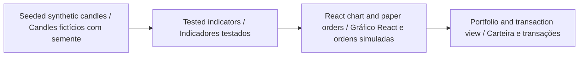

# Market Mechanics Workspace

[Open interactive example / Abrir exemplo interativo](https://galafis.github.io/trading-dashboard/)

### Painel de Dinâmica de Mercado

[](https://github.com/galafis/trading-dashboard/actions/workflows/ci.yml)
[English](#english) · [Português](#portugues) · [Examples / Exemplos](tests/indicators.test.js) · [Validation / Validação](docs/VALIDATION.md)

**Financial visualization / Visualização financeira** · Working prototype / Protótipo funcional · Gabriel Demetrios Lafis

<a id="english"></a>

## English

A bilingual React workspace for examining reproducible synthetic prices, technical indicators and paper portfolio operations.

### What works

- Seeded OHLCV examples feed a responsive chart, SMA, RSI, MACD and VWAP indicators.
- Paper buys and sells validate quantities, cash and holdings and immediately refresh portfolio summaries.
- The separate order-rule module supports limit, stop and persistent stop-limit triggers with regression tests.

### Reproducible walkthrough

Requirements: Node.js 24+ and pnpm 11 / Node.js 24+ e pnpm 11.

Run from the repository root. The validation environment installs the components exercised by the tests and documented example; optional integrations may need their separate dependencies.

```sh
pnpm install --frozen-lockfile
pnpm test
pnpm build
```

**Input contract / Contrato de entrada:** Synthetic OHLCV candles / candles OHLCV fictícios; seed / semente `42`; default end / término padrão `2026-01-01T00:00:00Z`.

**Expected behavior / Comportamento esperado:** Tests verify hand-calculated Wilder RSI values, zero-valued MACD signals, reproducible candles and cash conservation on a round-trip paper trade. / Testes verificam RSI de Wilder calculado manualmente, sinais MACD iguais a zero, candles reproduzíveis e conservação de saldo em compra e venda simuladas.

### Architecture / Arquitetura


```mermaid
flowchart LR
    A["Seeded synthetic candles / Candles fictícios com semente"]
    B["Tested indicators / Indicadores testados"]
    C["React chart and paper orders / Gráfico React e ordens simuladas"]
    D["Portfolio and transaction view / Carteira e transações"]
    A --> B --> C --> D
```

The main path can be followed in [src/services/technicalIndicators.js](src/services/technicalIndicators.js). Examples call the actual implementation and include assertions; they are not pseudocode.

### Scope and assumptions

All prices are synthetic; ticker names are illustrative. No brokerage, live quote feed or investment performance is represented. UI fills are immediate with no fees or slippage. The order-rule module is tested separately and is not a full exchange or portfolio settlement engine. Floating-point arithmetic is suitable for visualization, not custody accounting.

### Changes verified in this review

Restored the missing React application; corrected Wilder smoothing and zero MACD signals; prevented invalid trades, refreshed summaries after fills and latched stop-limit triggers.

<a id="portugues"></a>

## Português

Painel React bilíngue para examinar preços fictícios reproduzíveis, indicadores técnicos e operações de carteira simulada.

### Funcionalidades disponíveis

- Exemplos OHLCV com semente alimentam gráfico responsivo e indicadores SMA, RSI, MACD e VWAP.
- Compras e vendas simuladas validam quantidades, saldo e posições e atualizam os resumos imediatamente.
- O módulo separado de regras de ordens suporta limites, stops e gatilhos persistentes de stop-limit com testes.

### Execução reproduzível

Use os comandos da seção acima a partir da raiz do repositório. Requisitos: Node.js 24+ and pnpm 11 / Node.js 24+ e pnpm 11. O ambiente de validação instala os componentes exercitados pelos testes e pelo exemplo documentado; integrações opcionais podem exigir dependências próprias.

O fluxo principal está em [src/services/technicalIndicators.js](src/services/technicalIndicators.js). Os exemplos usam a implementação real e verificam resultados com asserções; não são pseudocódigo. O diagrama apresenta os mesmos passos nos dois idiomas.

### Escopo e premissas

Todos os preços são fictícios; nomes de ativos são ilustrativos. Não há corretora, cotações ao vivo ou desempenho de investimento representado. A interface executa imediatamente, sem taxas ou deslizamento. O módulo de regras é testado separadamente e não representa uma bolsa nem motor completo de liquidação. Ponto flutuante serve à visualização, não à contabilidade de custódia.

### Melhorias verificadas nesta revisão

Restaurada aplicação React ausente; corrigidos suavização de Wilder e sinais MACD zero; bloqueadas operações inválidas, atualizados resumos após execução e persistidos gatilhos stop-limit.

### Run the application / Executar a aplicação

```sh
pnpm dev --host 127.0.0.1
```

## Repository guide / Guia do repositório

| Location / Local                                                      | Purpose / Finalidade                                                   |
| --------------------------------------------------------------------- | ---------------------------------------------------------------------- |
| [Implementation / Implementação](src/services/technicalIndicators.js) | Main domain behavior / Comportamento principal do domínio              |
| [Example / Exemplo](tests/indicators.test.js)                         | Executable scenario / Cenário executável                               |
| [Tests / Testes](tests/)                                              | Normal behavior and failure cases / Fluxos válidos e casos de falha    |
| [Validation notes / Notas de validação](docs/VALIDATION.md)           | Corrections, evidence and boundaries / Correções, evidências e limites |
| [Workflow / Automação](.github/workflows/ci.yml)                      | Automated checks / Verificações automatizadas                          |

## Development / Desenvolvimento

EN: When changing behavior, update the contract, the worked example and a regression test together. Keep synthetic fixtures separate from real data. A passing test suite demonstrates the listed software behaviors; it does not certify a deployment or domain outcome.

PT: Ao alterar comportamento, atualize em conjunto o contrato, o exemplo e um teste de regressão. Separe amostras fictícias de dados reais. Testes aprovados demonstram os comportamentos de software listados; não certificam implantação nem resultado no domínio.

Author / Autor: [Gabriel Demetrios Lafis](https://github.com/galafis) · [Institutional contact / Contato institucional](mailto:gabrieldemetrioslafis@usp.br)

License / Licença: [repository license](LICENSE).
